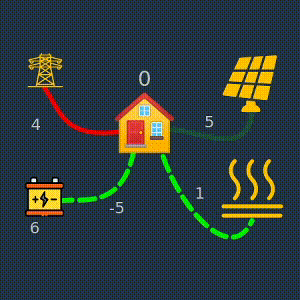
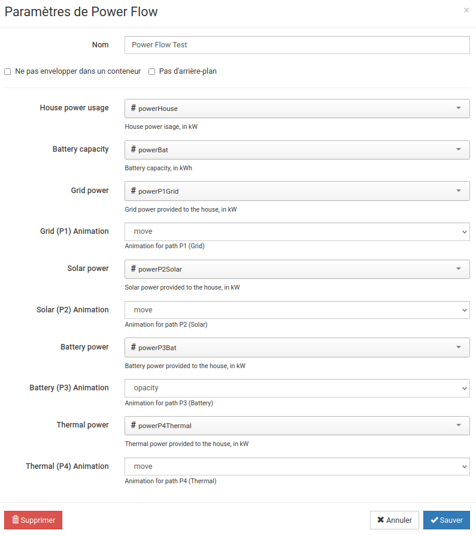

# habpanel-powerflow-widget

Power flow SVG widget for Habpanel (OpenHAB)
Allows displaying values inside an SVG as well as animation based on item states.

## Features

The power-flow connects to 6 openhab items:
- 'house' is kW total house power usage (displayed as text)
- 'bat' : battery charge in kwH (displayed as text)
- 'p1' : grid power to the house (displayed as text and animation)
- 'p2' : solar power to the house (displayed as text and animation)
- 'p3' : battery power delivered to (received from) the house (displayed as text and animation)
- 'p4' : thermal power to the house (displayed as text and animation)

The code is easy to change in order to accomodate other SVG and item selections.

## History

- 2021-07-29 published!

### Parameters

The widget can be configured in habpanel.
The basic configuration is the selection of items to display:

- 'house', 'bat' : value displayed as text
- 'p1, to 'p4' : values displayed as text and as animation

The animation for the 4 path can also be selected here ('move', 'pulse', 'opacity' ).

## Screenshot

## Settings

(sorry for the mixture of languages)

In french, but you get the idea...

## Demo

A standalone demo is provided in [powerFlow/index.html](powerFlow/index.html)

If everything is installed properly, you should find this demo on your openhab url, at /static/powerFlow/index.html.

## Installing

This widget relies on static files, which must be installed manually.
Simply copy the directory powerFlow into the static html area of openhab.

For openraspbian, just do

`cp -r powerFlow /etc/openhab2/html/`

If you install the file elsewhere, make sure you adjust the widget [power-flow.widget.json](power-flow.widget.json) file accordingly.

## How it works

The widget is angular with a single templateURL, which should provide an svg or html containing an svg.

The svg will be found by its id, and all animations are also found using the ids of the path to animate.

The text is simpler to setup. Inside the svg, any text with the form {{house}} will display automatically the
value of the variable 'house', which is associated to an item in the widget settings. Same for 'bat', and 'p1' to 'p4'.

### Animation

Since the whole svg is accessible to be modified dynamically according to items states, different animations are possible.

This widget focus on path animation of three types: width, opacity or dash offset, which are available in settings as 'pulse', 'opacity' and 'move'.

## how to customize

Ideally, use inkscape to edit the svg. The Object window and XML window (control-shift-X) are very useful for this.

* make sure the svg has id='svg8'
* identify the path with id='pathP1' to 'pathP4'

These ids are hardcoded in power-flow.js, but easy to change.

